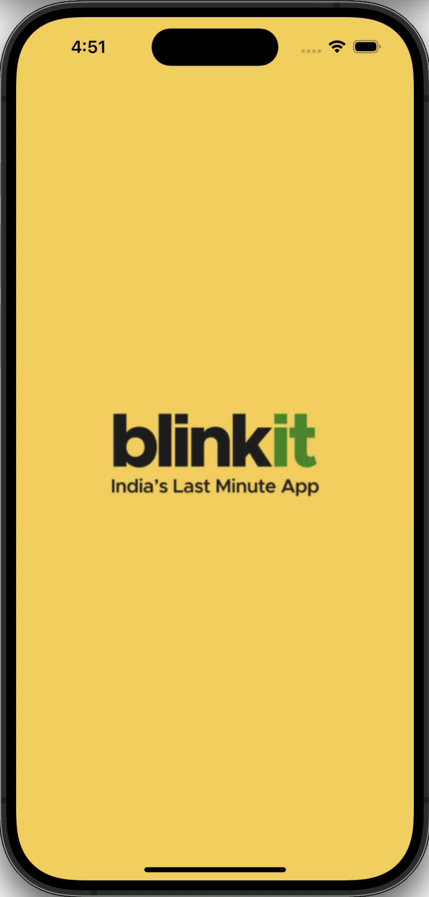
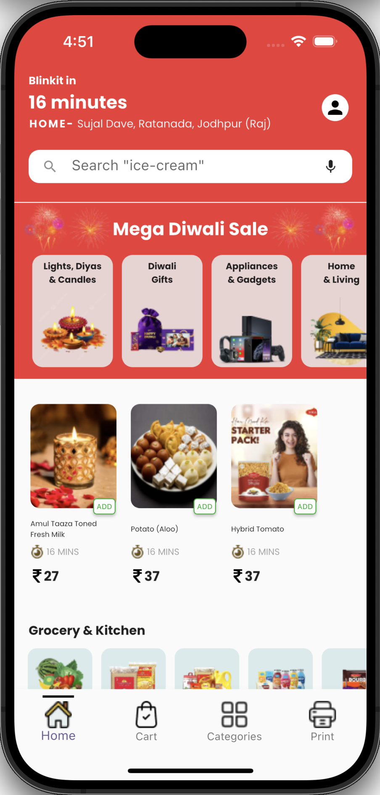
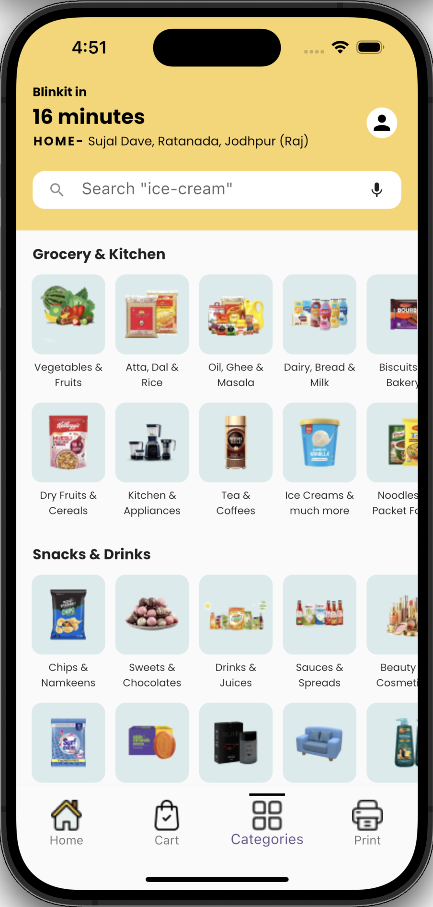
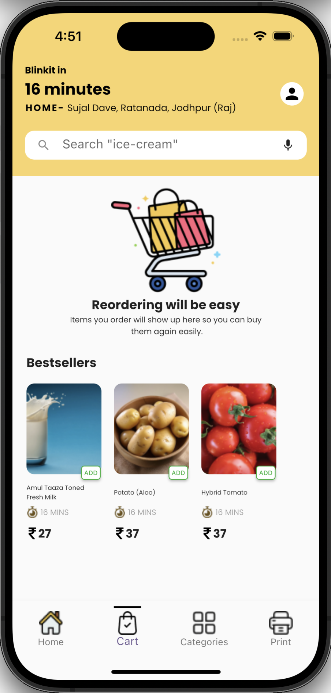
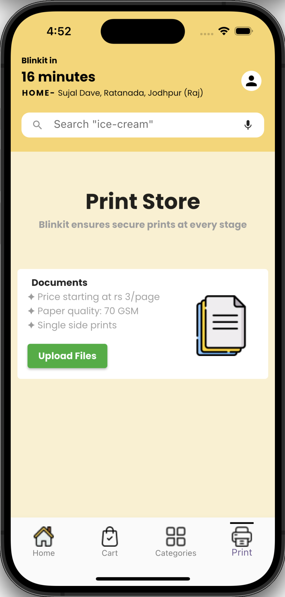

<div align="center">


# ⚡ Blinkit (Flutter Clone)

Reimagined ultra-fast grocery delivery experience built with Flutter. Clean feature‑based architecture, modular UI components, and production‑ready structure — crafted to showcase mobile engineering skills.

<b>Platforms:</b> Android • iOS • Web (Flutter) • macOS/Windows (desktop ready)

  -orange>) 

</div>

---

## ✨ Features

-   🟡 Splash screen & onboarding feel
-   🔐 Basic Auth (login UI screen)
-   🏠 Home feed with promotional sales sections
-   🗂️ Category browsing UI
-   🛒 Cart screen scaffold (ready for logic wiring)
-   🖨️ Print / Receipt style preview screen
-   🔁 Bottom navigation with feature isolation
-   🎨 Custom typography (Poppins) & asset-driven design
-   📁 Feature-first scalable folder structure

> Focus: Showcasing structure, separation of concerns, and UI composition for rapid iteration.

---

## 📸 Screenshots

| Splash                                                  | Login                                                  | Home                                                  | Categories                                                | Cart                                                  | Print                                                  |
| ------------------------------------------------------- | ------------------------------------------------------ | ----------------------------------------------------- | --------------------------------------------------------- | ----------------------------------------------------- | ------------------------------------------------------ |
|  |  |  |  |  |  |

> All screenshot assets live under `assets/screenshots/` for easy substitution.

---

## 🧱 Architecture Overview

This project uses a pragmatic **Feature‑First** layout:

```
lib/
 ├─ main.dart                # App entrypoint / root MaterialApp
 ├─ config/                  # (Future) global configs, themes, constants
 ├─ core/                    # (Future) shared utilities, services, models
 └─ features/                # Each domain feature is self-contained
	 ├─ splash/              # Splash screen UI
	 ├─ auth/                # Login screen(s)
	 ├─ home/                # Home feed & widgets
	 ├─ category/            # Category listing components
	 ├─ cart/                # Cart screen (logic-ready)
	 ├─ print/               # Print / receipt style preview
	 └─ nevigation/          # Bottom navigation shell
		 ├─ bottomnavscreen.dart
```

Guiding Principles:

-   Isolation: Each feature owns its screens + widgets.
-   Clarity over cleverness: Minimal abstractions until needed.
-   Progressive enhancement: `config/` & `core/` are placeholders for scaling (theme, API clients, DI, repos, etc.).
-   Asset-driven UI: Images kept under `assets/images/` & registered in `pubspec.yaml`.

---

## 🛠 Tech Stack

| Layer     | Choice                              | Notes                                       |
| --------- | ----------------------------------- | ------------------------------------------- |
| Framework | Flutter 3.x                         | Cross-platform UI toolkit                   |
| Language  | Dart 3.x                            | Null safety enabled                         |
| Routing   | Implicit (home + manual navigation) | Can evolve to GoRouter / Beamer             |
| State     | setState (currently)                | Replaceable with Provider / Riverpod / Bloc |
| Fonts     | Poppins (Bold / Regular)            | Configured in `pubspec.yaml`                |
| Assets    | Local PNG images                    | Optimized for rapid prototyping             |

---

## 🚀 Quick Start

Prerequisites: Flutter SDK (3.x) installed.

```bash
git clone https://github.com/shahriarnur03/Blinkit_flutter.git
cd Blinkit_flutter
flutter pub get
flutter run   # Select a device / emulator
```

Optional (Web Preview):

```bash
flutter run -d chrome
```

---

## 📂 Detailed Folder Structure

```
assets/
 ├─ images/                  # UI images & icons (promo, categories, products)
 ├─ fonts/                   # Poppins font family
 └─ screenshots/             # Static showcase screenshots used in README
lib/
 ├─ main.dart                # App root (MaterialApp + Splash)
 ├─ features/
 │   ├─ splash/              # Splash screen widget(s)
 │   ├─ auth/                # Login UI (future expansion: OTP, session)
 │   ├─ home/                # Home screen + sales widget cards
 │   ├─ category/            # Category browsing UI & list widget
 │   ├─ cart/                # Cart layout (future: pricing logic, state)
 │   ├─ print/               # Print-style invoice / preview screen
 │   └─ nevigation/          # Bottom navigation controller
 ├─ config/                  # (Scalable placeholder)
 └─ core/                    # (Scalable placeholder)
test/                        # Basic Flutter widget test
```

---

## 🧪 Testing

Basic starter test exists under `test/widget_test.dart` (generated). Future enhancements could add:

-   Golden tests for UI consistency
-   Unit tests for pricing & cart logic
-   Integration tests for navigation flows

Run all tests:

```bash
flutter test
```

---

## 🔮 Roadmap Ideas

-   [ ] Real authentication (Firebase / Supabase)
-   [ ] State management upgrade (Riverpod or Bloc)
-   [ ] Product & category models with mock/local JSON
-   [ ] Cart persistence + price calculations
-   [ ] Dark theme + theming system in `config/`
-   [ ] Router migration (GoRouter) with deep links
-   [ ] Localization (intl) & RTL support
-   [ ] Analytics + crash reporting integration
-   [ ] CI workflow (GitHub Actions) for tests & format
-   [ ] Release build badges & store deployment script

---

## 💡 Recruiter Highlights

| Skill Area     | Demonstrated By                                                |
| -------------- | -------------------------------------------------------------- |
| Architecture   | Feature-first modular folder layout                            |
| UI/UX          | Consistent spacing, typography, asset usage                    |
| Code Quality   | Separation of widgets per feature, readiness to scale          |
| Extensibility  | Placeholder layers (`core/`, `config/`) for services & theming |
| Delivery Focus | Screens cover core grocery app journey                         |

---

## 🧩 Extending This Project

1. Add a `core/services/` folder for API, storage, logging.
2. Introduce a `models/` folder inside each feature or a shared `core/models/`.
3. Extract theme + color palette into `config/theme.dart`.
4. Add dependency injection (e.g., `get_it`) when services appear.
5. Migrate navigation to declarative router for maintainability.

---

## 🛡️ License

Currently private / educational. Add an OSS license (MIT / Apache-2.0) if you plan to open-source.

---

## 🙌 Acknowledgements

Inspired by modern instant‑delivery UX patterns. Built with ❤️ using Flutter.

---

### 📬 Contact

Feel free to reach out via GitHub Issues or connect on LinkedIn (add your profile link here).

---

> If this project helps you, consider leaving a ⭐ to support visibility.
